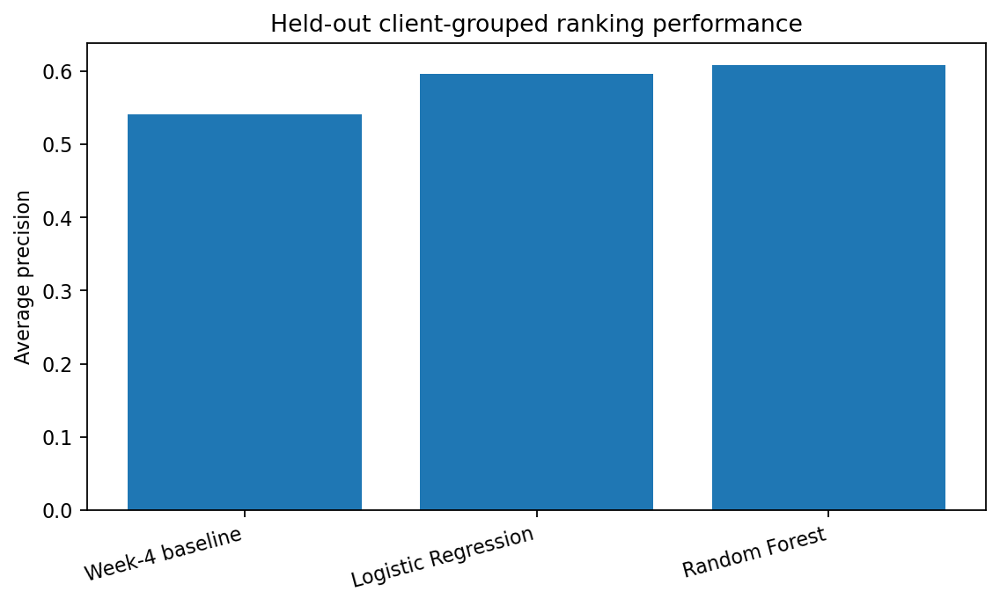
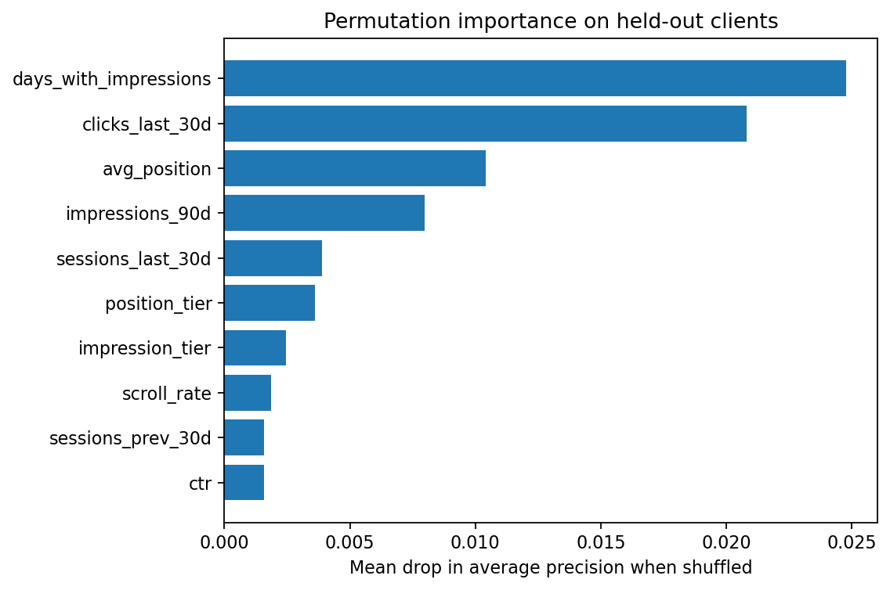
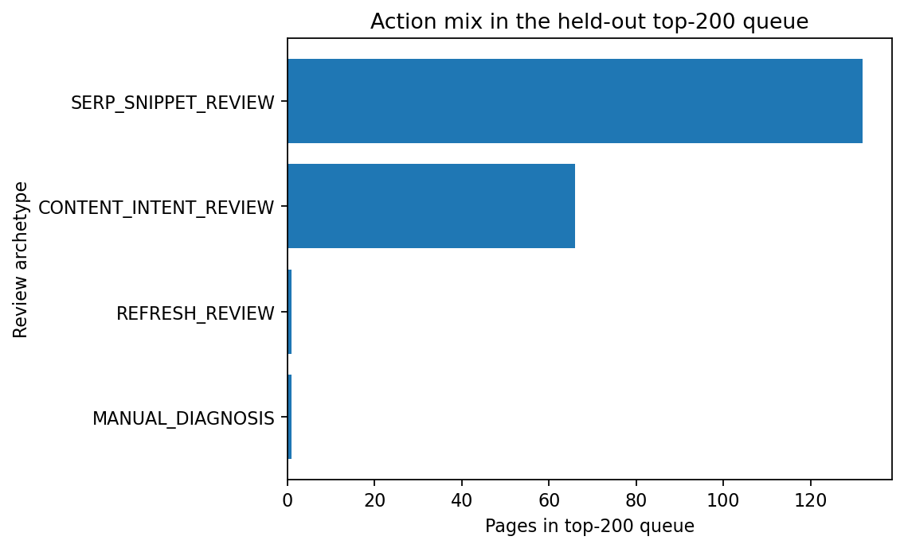

# Which SEO Content Pages Should Be Reviewed First?

- **Author:** anelchik
- **Lane:** Content Review Priority Ranking
- **Repo:** https://github.com/anelchik/anelsinternshipwork
- **Date:** 2026-08-14

## Abstract

This capstone asks a practical ranking question: **which pseudonymized content pages should an SEO specialist review first when the available snapshot signals resemble pages with an observed decline?** I use a 30,000-row anonymized content dataset and define the observed outcome as `trend_direction == "down"`. A Random Forest is compared with Logistic Regression and a transparent rule baseline on the **same 75/25 client-grouped holdout**, while direct label-derived fields and identifiers are excluded from model features. On unseen clients, the Random Forest reaches **average precision (AP) 0.608 and ROC AUC 0.623**, compared with **AP 0.541 and ROC AUC 0.530** for the rule baseline; a deliberately naïve random-row audit reaches AP 0.806, showing how much validation design can inflate the apparent result. I therefore use the model only as **directional decision-support**: it prioritizes human review and attaches transparent reason codes, but it does not diagnose causes, guarantee future decline, or estimate the effect of an edit.

## 1. Problem framing

The decision is operational: **which content pages should an SEO specialist review first when review capacity is limited?** The unit of analysis is one pseudonymized content page. The output is a ranking score and a review queue, not an automatic content change.

A reviewer uses the queue to decide where to spend attention first, then checks the actual page and search context before acting. A false positive wastes review time and can encourage an unnecessary edit. A false negative delays review of a page that is experiencing an observed decline. Because an unnecessary intervention can itself be harmful, the workflow intentionally keeps the final decision with a human.

ML is useful here because no single allowed signal is a reliable diagnosis. The task is to combine many weak search, traffic, content, freshness, and engagement signals into a consistent triage order while preserving clear claim boundaries.

## 2. Data safety

The project uses the anonymized FlyRank content-refresh release with **30,000 rows, 44 columns, and 32 pseudonymous clients**. The release contains page-level content descriptors, search visibility summaries, traffic/engagement summaries, freshness fields, and rolling measurement windows. It does not expose calendar dates in this file; the analysis therefore works with the supplied 90-day aggregates and adjacent 30-day summaries.

The observed binary target is `trend_direction == "down"`. I deliberately exclude the following fields from the model:

- `trend_direction` — the target itself;
- `trend_pct` — the direct numeric source of the trend label;
- `impressions_last_30d` and `impressions_prev_30d` — together they reconstruct the recent trend calculation and therefore leak the answer;
- `content_id` and `client_id` — identifiers, not predictive features.

`client_id` is used only for grouped splitting. The leakage audit reconstructs `trend_pct` from the two recent impression windows with near-perfect agreement, which is why those fields are not allowed into the feature matrix.

The public artifacts do not contain client names, URLs, or raw/private queries. The ranked operational queue retains only pseudonymized `content_id` so a reviewer can identify a row without exposing a client identity.

## 3. Baseline

The transparent baseline is the Week-4 priority rule rebuilt on the same training/test split as the learned models. It combines two intuitive signals:

1. a **CTR gap**: observed CTR below the training-derived median CTR for the page's average-position bucket; and
2. **90-day impression opportunity**: higher-impression pages receive more priority.

The baseline score is `0.65 × CTR-gap percentile + 0.35 × impression percentile`, with both reference distributions learned from training rows only. This makes it a fair comparison: the rule and the learned models see the same held-out rows, and none of them learns reference statistics from the test outcomes.

On the client-grouped holdout, the baseline reaches **AP 0.541** and **ROC AUC 0.530**. Its precision is **0.70 at K=20** and **0.74 at K=50**.

## 4. Model / analysis

This is a **binary ranking** problem rather than an autonomous classification system. A page is positive when its observed `trend_direction` equals `down`, and the operational goal is to put more positive pages near the top of a limited review queue.

I compare two learned models:

- **Logistic Regression**, used as a readable linear probability ranker;
- **Random Forest**, used as a nonlinear comparison.

After the six forbidden fields are removed, the model uses the remaining **38 features**. Numeric features receive median imputation, missingness indicators, and standardization. Categorical features receive most-frequent imputation and one-hot encoding with unknown categories ignored at test time. All random seeds are fixed at **42**.

The validation design is a single reproducible **75/25 grouped holdout by `client_id`**. It contains **22,885 training rows from 24 clients** and **7,115 test rows from 8 completely unseen clients**, with **zero client overlap**. The test positive rate is **0.517**.

This split is important because pages from one client can share site-level patterns, tracking conventions, or content systems. A random row split would let the same client appear on both sides and answer an easier question.

## 5. Evaluation

All methods are evaluated on the same held-out clients.

| Method | Average precision | ROC AUC | Precision@20 | Precision@50 |
|---|---:|---:|---:|---:|
| Random Forest | **0.608** | **0.623** | 0.60 | 0.66 |
| Logistic Regression | 0.596 | 0.599 | **0.95** | 0.68 |
| Week-4 baseline | 0.541 | 0.530 | 0.70 | **0.74** |

The Random Forest has the strongest overall AP, improving AP by about **0.067 absolute** over the rule baseline. Logistic Regression is close and has much stronger precision@20, while the hand-built rule remains competitive at precision@50. That is useful negative evidence against the idea that more model complexity automatically produces a better operational queue.

The validation audit is the most important result for claim strength. The same Random Forest design reaches **AP 0.807 / ROC AUC 0.793** under a random row split, but only **AP 0.608 / ROC AUC 0.623** under the client-grouped split. The approximately **0.20 AP drop** shows that random-row validation substantially overstates transfer to unseen clients.



*Takeaway: the learned model improves overall ranking discrimination over the transparent rule on unseen clients, but the gain is moderate rather than dramatic.*

### Error analysis

The ranking is not a diagnosis. Among the top-50 queue, some pages receive very high scores even though their observed label is not down. Conversely, some observed declines receive scores near the bottom of the queue. These mistakes are expected when the direct last-30-days-versus-previous-30-days impression fields are intentionally excluded.

The failure pattern suggests two practical cautions. First, pages can look similar in the allowed snapshot features while differing in unobserved query mix, seasonality, SERP changes, or measurement noise. Second, a genuine decline can occur without strong warning signals in the allowed features. Honest validation should expose these misses rather than remove them with leakage.

## 6. Interpretation

Permutation importance on the untouched grouped test split shows the largest AP drops when the following features are shuffled:

| Feature | Mean AP drop |
|---|---:|
| `days_with_impressions` | 0.0248 |
| `clicks_last_30d` | 0.0208 |
| `avg_position` | 0.0104 |
| `impressions_90d` | 0.0080 |
| `sessions_last_30d` | 0.0039 |
| `position_tier` | 0.0036 |
| `impression_tier` | 0.0025 |
| `scroll_rate` | 0.0019 |
| `sessions_prev_30d` | 0.0016 |
| `ctr` | 0.0016 |



*Takeaway: search exposure, recent click/session activity, and ranking position carry the strongest predictive association in this model; they are not established causal levers.*

This distinction matters. A feature can help rank pages because it is associated with the observed outcome without being something an editor should directly optimize. The model does not establish that increasing `days_with_impressions`, changing position, or changing any other feature would cause recovery.

## 7. Recommendation

The output should be used as a **human-review priority queue**. The model score answers *where to look first*. Transparent reason codes then describe which non-leaking visible signals make a particular review archetype plausible.

The top-200 held-out queue contains:

| Review archetype | Pages |
|---|---:|
| `SERP_SNIPPET_REVIEW` | 132 |
| `CONTENT_INTENT_REVIEW` | 66 |
| `MANUAL_DIAGNOSIS` | 1 |
| `REFRESH_REVIEW` | 1 |



*Takeaway: most high-priority pages warrant a SERP/snippet or content/intent review; the queue does not imply that those interventions will cause improvement.*

The review archetypes are:

- **SERP/snippet review:** high score plus CTR below the training-derived position norm, particularly in positions 4–20. A human should inspect live SERP layout and query intent before changing titles or metadata.
- **Content/intent review:** high score plus weak engagement. A human should inspect whether the page still satisfies the current user task; weak engagement alone is not a quality diagnosis.
- **Refresh review:** high score plus substantial time since the last update. The reviewer must confirm that facts, examples, products, links, or screenshots are actually stale before editing.
- **Manual diagnosis:** high score without a clean single archetype. Investigate multiple possible causes rather than forcing an action.

### Human-review no-go cases

The system should **not** automatically rewrite, delete, redirect, deindex, or merge a page. It should not change legal, pricing, compliance, or brand-sensitive copy from a model score. It should not infer that the score caused the decline or claim expected lift/ROI without an intervention experiment or another causal design.

### Monitoring and retraining

The playbook should be re-audited when:

- grouped-validation AP falls by more than **0.10 absolute** from the current 0.608 anchor;
- the median model score shifts by more than **0.10 absolute**;
- a core feature's new median leaves the current held-out interquartile range;
- target construction, tracking definitions, schema, or content taxonomy changes.

A data-quality failure should be investigated before retraining. Retraining should not be used to hide a broken pipeline.

## 8. Reproducibility

The capstone notebook regenerates the model comparison, leakage checks, error examples, top-200 queue, JSON metrics, CSV tables, and three paper figures.

From a fresh clone, place the anonymized release at the repository data path used by the project, then run:

```bash
python -m venv .venv
source .venv/bin/activate          # Windows: .venv\Scripts\activate
pip install pandas numpy scikit-learn matplotlib jupyter nbconvert
jupyter nbconvert --to notebook --execute work/notebooks/capstone.ipynb \
  --output capstone.executed.ipynb --ExecutePreprocessor.timeout=600
```

The random seed is **42**. The key reproducibility artifacts are:

- `work/notebooks/capstone.ipynb`
- `work/outputs/capstone_metrics.json`
- `work/outputs/capstone_model_comparison.csv`
- `work/outputs/capstone_ranked_action_queue.csv`
- `work/figures/capstone_model_vs_baseline.png`
- `work/figures/capstone_feature_importance.png`
- `work/figures/capstone_action_mix.png`

The operational queue intentionally excludes `client_id`, the target label, `trend_pct`, leaked trend-window fields, URLs, and private queries.

**On reproducing this report:** the notebook was re-executed from a clean kernel for this submission. Average precision and ROC AUC reproduced to three decimal places against the earlier run recorded during development. The Random Forest's `Precision@50` and the exact top-200 archetype counts shifted by one or two rows (e.g. 0.62 → 0.66; `SERP_SNIPPET_REVIEW` 131 → 132) between runs even with `random_state=42` fixed everywhere, because `RandomForestClassifier(n_jobs=-1)` builds trees across threads and floating-point summation order is not guaranteed identical run to run — this shows up only in metrics sensitive to exact score ties near a hard cutoff, not in the ranking-quality metrics (AP/ROC AUC) the paper's claims rest on. The numbers in this report are the values from the fresh run committed alongside it.

## Limitations and honest framing

The strongest defensible statement is narrow:

> **On a held-out client-grouped split, the model provides a measured ranking signal for pages associated with an observed decline. I use that signal as directional decision-support to prioritize human review, then attach transparent non-leaking reason codes and review archetypes. The playbook does not automate edits, diagnose causes, or claim that a recommended intervention will improve performance.**

This work does not establish causality, does not provide a fully time-forward forecast, does not measure the treatment effect of the recommended actions, and does not guarantee performance for clients outside the evaluated population. The results should therefore be treated as evidence for prioritization, not as an automated SEO decision engine.

## Appendix: full feature list

The model uses these 38 columns as input (everything in the release except the six excluded fields listed in §2):

`search_volume`, `competition`, `competition_level`, `cpc`, `content_type`, `main_intent`, `word_count`, `char_count`, `provider_used`, `model_used`, `impressions_90d`, `clicks_90d`, `pageviews_90d`, `sessions_90d`, `users_90d`, `engaged_sessions_90d`, `ai_sessions_90d`, `scroll_events_90d`, `days_with_impressions`, `days_with_sessions`, `clicks_last_30d`, `sessions_last_30d`, `clicks_prev_30d`, `sessions_prev_30d`, `content_age_days`, `age_tier`, `age_tier_order`, `days_since_last_update`, `freshness_tier`, `word_count_tier`, `char_count_tier`, `ctr`, `avg_position`, `engagement_rate`, `scroll_rate`, `ai_traffic_pct`, `impression_tier`, `position_tier`.

Note that `clicks_last_30d` and `sessions_last_30d` (and their `_prev_30d` counterparts) are kept: they are engagement-volume windows, distinct from the `impressions_last_30d` / `impressions_prev_30d` pair that is excluded because it directly reconstructs `trend_pct`, the source of the target.

## Acknowledgments and data credit

This capstone uses the anonymized FlyRank internship content-refresh dataset supplied for the project and builds on the earlier baseline, model, validation-audit, and action-playbook assignments in the same repository. No private client names, URLs, or raw search queries are reproduced in this report.
